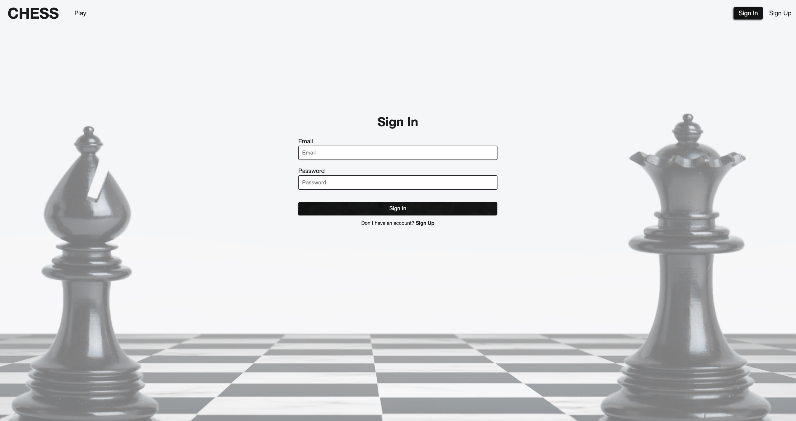
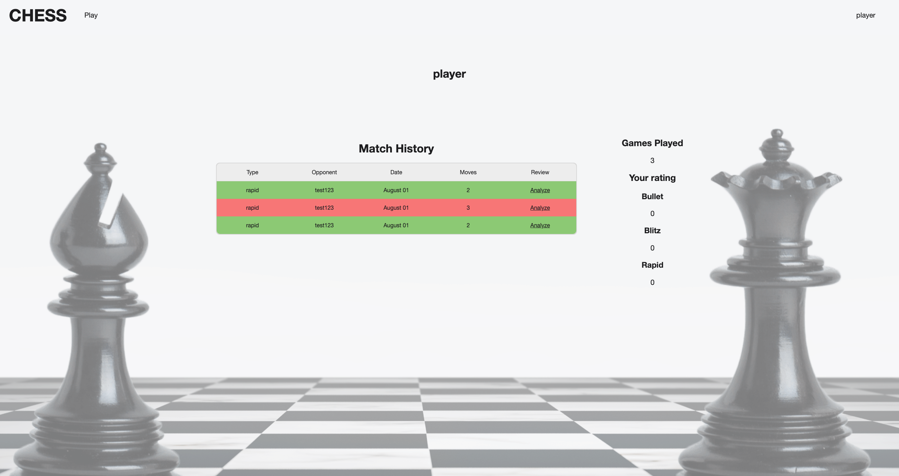
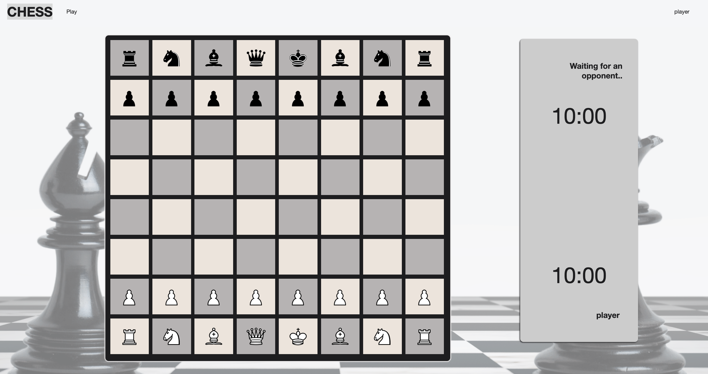
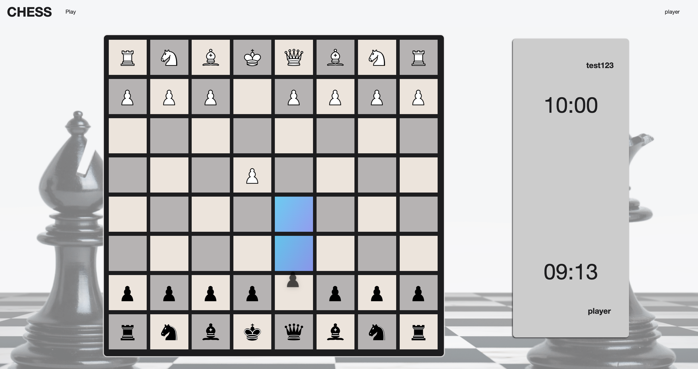
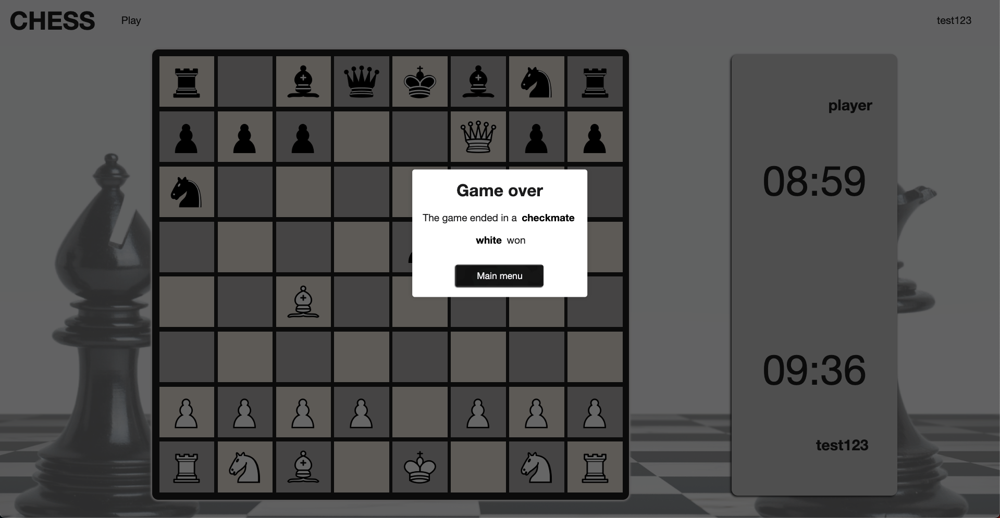

# Chess Project

### *Work in progress*

### Description

Chess is a web application developed using Django Rest Framework for the backend and ReactJS for the frontend. It leverages WebSockets to enable real-time gameplay and provides users with the ability to play chess against opponents online.

#### Technologies Used:
* Django Rest Framework
* Docker
* PostgreSQL
* Redis
* TypeScript
* ReactJS

#### Features:
* WebSockets
* JWT Authentication

###

